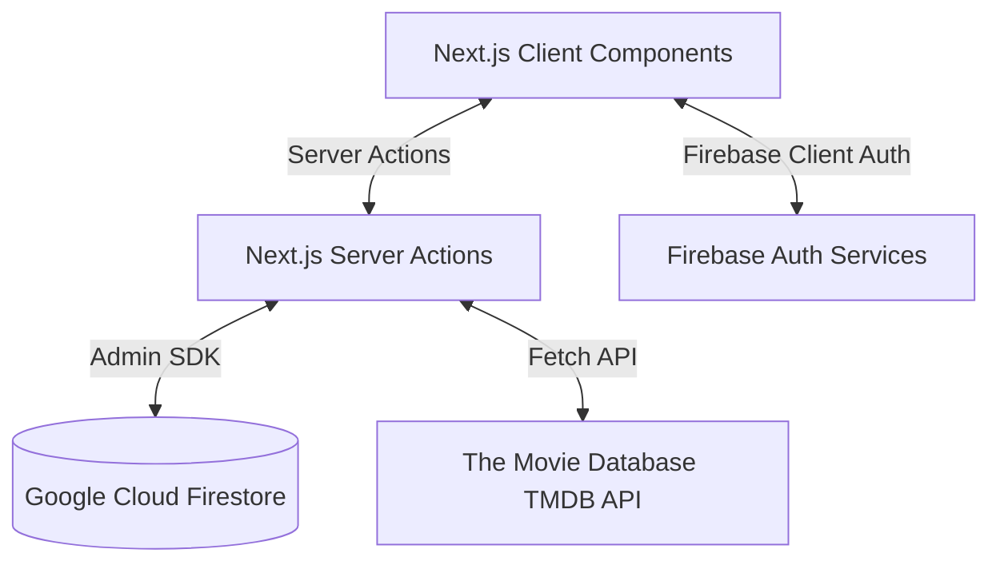

# Cinephile Architecture

This document describes the high-level system architecture, data flow, and code conventions utilized in the Cinephile movie community platform.

---

## System Topology & Tech Stack

Cinephile is built as a hybrid SSR/client application:

* **Framework**: Next.js 16.2 (App Router)
* **Hosting / Runtime**: Node.js Serverless Environment
* **Primary Database**: Google Cloud Firestore (using NoSQL collection/document model)
* **Auth**: Firebase Authentication (Client-side token exchange, authenticated sessions synced server-side)
* **Media API**: The Movie Database (TMDB) for rich catalog lookup, backdrops, and summaries.

---

## Key Core Layers

### 1. Presentation Layer (`src/app/`)
* **Layouts & Pages**: Pages default to Server Components for initial quick renders and SEO metadata injection. Dynamic feeds use `force-dynamic` settings.
* **Component Hybrids**: Highly interactive controls (like ratings, reaction buttons, dialog modals) are split off into `"use client"` files.

### 2. Actions Layer (`src/actions/`)
* **Type-Safe Operations**: Next.js Server Actions handle authentication validations (`verifySession`), Firestore operations, and cached path revalidations (`revalidatePath`).
* **Session Integrity**: Client cookies are decoded server-side via the Firebase Admin SDK to guarantee that user credentials cannot be spoofed.
* **Batch Commit Writes**: Operations modifying multiple tables (like list additions with activity log writes) run inside transactional Firestore batch operations to ensure database consistency.

### 3. State & Context Layer (`src/features/`)
* **AuthProvider**: Custom React Context managing client auth state, synchronization with Firestore profiles, and redirect handling.
* **Optimistic UI Hooks**: Toggles like reactions, bookmarks, and follower counts update state immediately on the screen, rolling back only on transaction failure notifications.

### 4. Integration Proxies (`src/lib/`)
* **TMDB Proxy**: Direct fetch wrapping TMDB requests with bearer credentials, error logging, and standard fallbacks.
* **Animations Presets (`src/lib/animations.ts`)**: Centralized Framer Motion specifications governing hover physics and fades.

---

## Data Synchronization Patterns

### Denormalized Snapshots
Firestore is a NoSQL store. To avoid costly nested reads when showing feeds, we use **denormalized activity snapshots**:
* When a list is created, we snapshot the first 4 poster URLs, list title, items count, and author display name directly into the activity document.
* When the feed page loads, it queries only the flat `/activities` collection rather than running additional subqueries for every list, decreasing read counts by up to 90%.

### Throttled Reads / Write Mitigation
* **LocalStorage Throttling**: List views are logged inside the user's local browser cache. View increments (`incrementListViews`) are throttled client-side to once every 24 hours per visitor to prevent database write loops.
* **Optimistic Execution**: UI updates immediately. Server transactions are resolved in the background. On action failure, state hooks rollback to initial values seamlessly.
