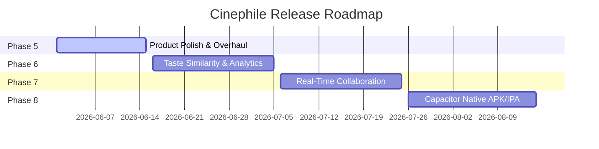

# Cinephile Product Roadmap

This document outlines the development trajectory of Cinephile, extending from current polish iterations to social, analytic, and mobile-native expansions.

---

## 🗺️ Future Phases Overview

---

## Phase 5 — 🌟 Product Polish & Performance (Current)
Eliminate layout jumps, add standard loaders, and introduce fallback architectures:
* **Skeleton Loaders**: Independent loaders for `FeedCard`, `MediaCard`, `ListCard`, `ProfileHeader`, and `Notifications`.
* **Empty State Banners**: Standardized `EmptyState` modules replacing plain text blocks across search, profiles, notifications, and feed.
* **Optimistic UI & Rollbacks**: Immediate state reactions on likes, saves, comments, and follows, with transaction-aware failure rollbacks.
* **Error Bounds**: App-wide React ErrorBoundaries, `app/error.tsx`, and themed 404 pages to capture and gracefully isolate Firestore/TMDB offline spikes.
* **Indexes & Seeding**: Automated composite index config mappings and realistic database seed generator (`scripts/seeder.ts`).

---

## Phase 6 — 📊 Taste Similarity Index & Analytics (Upcoming)
Introduce advanced social comparisons and compatibility metrics:
* **Taste Compatibility Score**: Algorithm evaluating overlapping ratings, matched genres, and mutual favorite lists between any two users (e.g. *"94% Movie Match: Both of you love Nolan and Kurosawa"*).
* **Shared Highlights Component**: Side-by-side comparison overlays on profiles showing mutual watched titles and contrasting scores.
* **Stats Visualizer Panel**: Interactive graphs showing watch trends over months, genre breakdown pie charts, and rating distribution histograms.

---

## Phase 7 — 👥 Real-Time Collaborative Curation Rooms
Scale list creation into collaborative social spaces:
* **Live Co-Authoring**: Concurrent list editing sessions powered by real-time Firestore synchronization. Includes live cursor activity markers.
* **Collaborator Activity Chats**: Dedicated message threads pinned directly to the list editor pane for curating and discussing item order index changes.
* **Snapshot Versioning**: Restore list configurations to historic snapshots before unwanted adjustments were introduced.

---

## Phase 8 — 📱 Native Mobile Conversion (Capacitor & Offline Sync)
Package the Cinephile responsive Next.js application into a native mobile app shell:
* **Capacitor Integration**: Native Android/iOS wrappings using `@capacitor/core` and `@capacitor/android` configurations.
* **Offline Operations Queue**: Service worker layer intercepts track/rewatch calls when offline, queuing them in browser `IndexedDB` and syncing them immediately when connection is restored.
* **Native Push Notifications**: Configure Firebase Cloud Messaging (FCM) through Capacitor plugins to route list comments and follow updates directly to mobile system trays.
